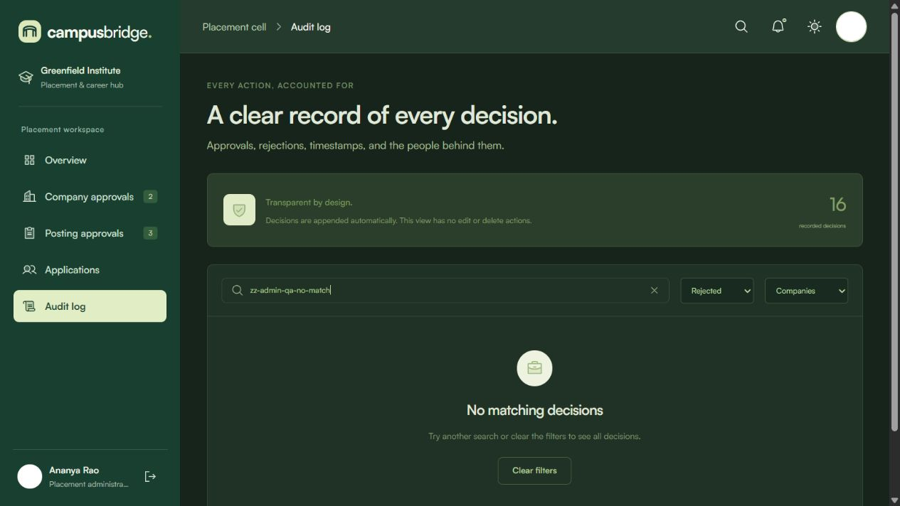
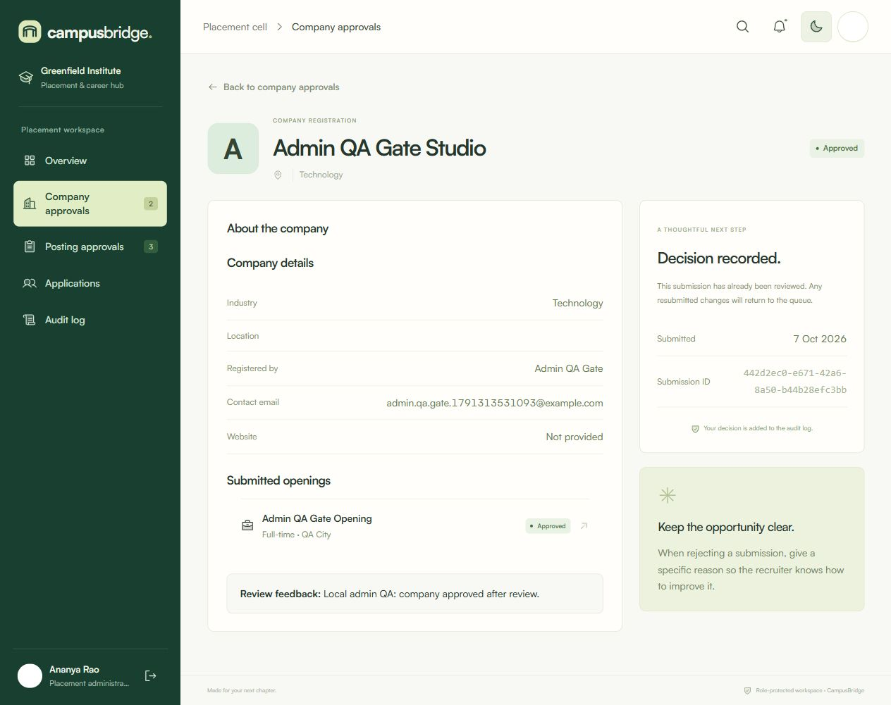
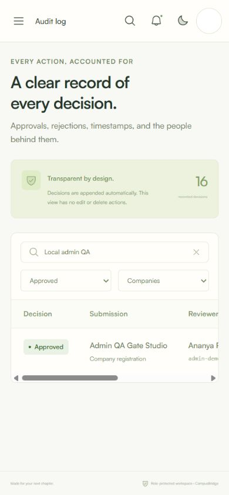
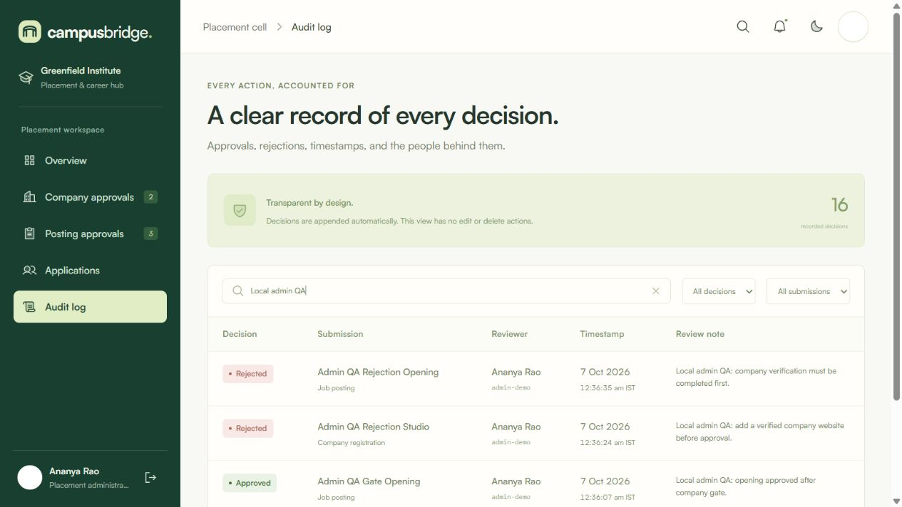
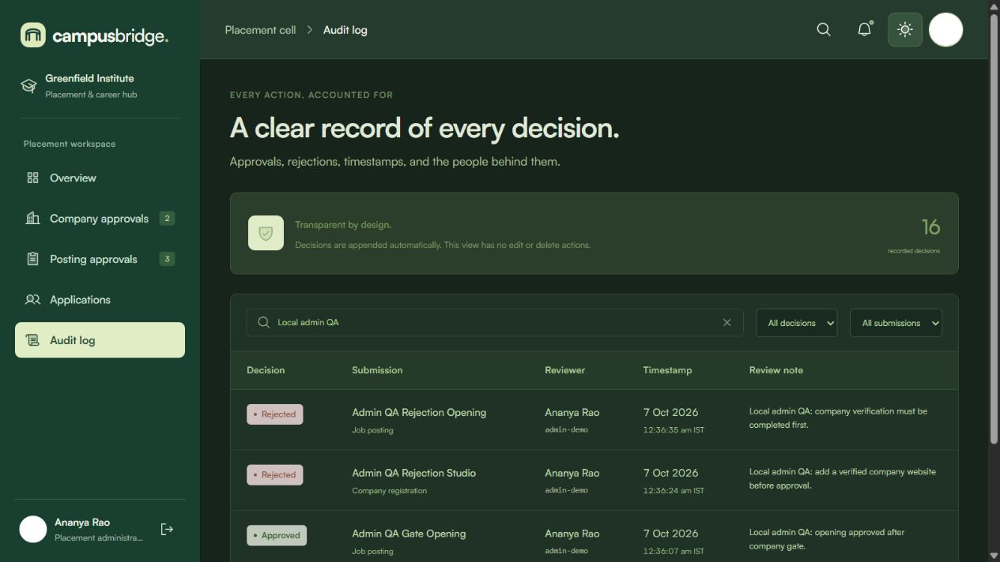

# Admin role QA review

Reviewed 7 October 2026 against the compiled local Worker at `http://127.0.0.1:8787`, baseline commit `06f0c24` on `feat/role-reviewed-uploads`. Authentication was demo mode; private uploads were enabled. Browser review used a dedicated hidden Codex browser tab, without changing the shared viewport. Screenshots are approximately 1265 × 714. Only local mock data was mutated; no deployed environment or real account was used.

All three findings below were fixed by the root implementer and independently retested against the rebuilt local app on 7 October 2026. Their original reproduction steps are retained as review history; there are no unresolved findings from this admin review. See the resolution section for observed evidence.

## Findings

### Resolved P2 — Opaque or malformed Origin produces a server error

Route: `POST /api/review` (the shared mutation origin guard).

Steps: send an otherwise ordinary JSON request with `Origin: null`, then repeat with `Origin: not-a-url`. Both returned HTTP 500 with `Something went wrong. Please try again.` A valid foreign origin (`https://attacker.test`) correctly returned 403.

Expected: consistently reject untrusted, opaque, or malformed origins with 403 before handling the mutation.

Cause/proposed fix: the local-host branch calls `new URL(origin)` without handling invalid/opaque values. Parse defensively and reject invalid origins. This is an error-handling issue; the tested inputs did not bypass authorization or mutate data.

### Resolved P3 — Filtered audit empty state implies there are no decisions

Route: `/admin/logs`.

Steps: with 16 recorded decisions visible, enter `zz-admin-qa-no-match` in audit search. The table disappears and the page says `A fresh page in your record.` and `Decisions will appear here as submissions are reviewed.`, while the summary still says 16 recorded decisions.

Expected: explain that the active search/filters matched no records, and provide a clear way to reset filters. Reserve first-time-empty wording for a genuinely empty audit history.

Proposed fix: derive filtered-empty state separately from `data.logs.length === 0`, use `No matching decisions`, and offer a reset action.

Current evidence after resolution: [corrected filtered audit empty screenshot](qa-admin-filter-empty.jpg).

### Resolved P3 — Approval notes use rejection/error emphasis

Routes: company and posting detail pages after an approval with a note.

Steps: approve `Admin QA Gate Studio` with `Local admin QA: company approved after review.`, then approve its opening with `Local admin QA: opening approved after company gate.`. Both show the saved approval text under `Review feedback` in a `form-error` element.

Expected: approval context should use neutral or success styling; rejection/error styling should identify adverse feedback or validation failures.

Proposed fix: choose feedback styling by the persisted status, keeping error/rejection styling for rejected submissions.

## Resolution retest

| Finding | Independent retest result |
| --- | --- |
| Malformed/opaque Origin | Real HTTP requests to the updated local `/api/review` with `Origin: null`, `Origin: not-a-url`, and a valid foreign Origin all returned 403 with `Request origin is not allowed.` No server error or mutation occurred. |
| Filtered audit empty state | In the actual browser, combined unmatched search + Rejected + Companies displayed `No matching decisions` and `Try another search or clear the filters to see all decisions.` The summary retained the truthful total of 16 decisions. Clicking Clear filters cleared search, reset both filters to All, and restored the table. |
| Approval feedback styling | Existing approved company and posting notes rendered with class `review-feedback`, without `form-error`. Full-page screenshots verified neutral feedback styling in light and dark appearances. The existing rejected company retained `form-error` and its rejection reason. |

The corrected empty-state screenshot replaced `qa-admin-filter-empty.jpg`. Additional fixed approval evidence is saved in [light appearance](qa-admin-approval-fixed-light.jpg) and [dark appearance](qa-admin-approval-fixed-dark.jpg). Retesting changed no review decisions or application records, and the viewport remained unchanged during the desktop resolution checks. The mobile review below was performed later in an explicitly coordinated viewport window.

## Browser checks that passed

| Area | Observed result |
| --- | --- |
| Admin quick login | Entered `/admin` as Ananya Rao, placement administrator. |
| Overview | Metrics, pending queue links, and recent decisions matched the available state. |
| Company queue | Pending and approved tabs, detail links, owner/contact fields, and linked openings rendered correctly. |
| Company approval | Confirmation showed reviewer `admin-demo`; approval persisted, controls disappeared, and a success toast appeared. |
| Company rejection | Empty reason triggered browser required-field validation. Concrete rejection reason persisted and appeared on the detail page. |
| Posting approval gate | Approval was disabled while the company was pending, became available after company approval, and remained disabled for a rejected company. |
| Posting decisions | Approval and rejection persisted with review notes and success notifications. |
| Audit history | Four QA decisions appeared with correct target links, reasons, `admin-demo`, reviewer name, date, and second-resolution IST timestamps. |
| Audit filters | Search `Local admin QA` plus Rejected + Companies left exactly the company rejection. |
| Header search | Searching `admin-demo` navigated to `/admin/logs?search=admin-demo`, populated audit search, and showed the reviewer’s records. |
| Notifications | Latest four QA decisions appeared; Escape dismissed the panel and returned focus to the trigger. |
| Applications | Campus-wide table remained read-only. Search `Layers` plus Interview showed five matching applications. |
| Account menu | Displayed admin name/email/role, photo picker, supported formats/size, and sign-out. |
| Photo validation | A dummy SVG was refused with `Choose a JPG, PNG, or WebP image.` |
| Photo upload | Valid dummy PNG uploaded; `Profile photo updated.` appeared and header/sidebar/account avatars refreshed. |
| Light/dark | Audit tables, summary, account menu, navigation, and controls were visually checked in both appearances. Primary labels and decisions remained readable; metadata is small but legible at the unchanged desktop viewport. |
| Browser back | Returned from posting detail to company detail correctly. |
| Unknown route | `/admin/unknown-qa-route` displayed Page not found plus a working Go to overview action. |
| Wrong-role route | Navigating to `/student/profile` as admin redirected to `/admin` and displayed an access warning. |
| Logout | Sign-out returned to the public landing page with a success toast. Browser Back then redirected to `/login`; the admin workspace did not reappear. |

## Direct API checks that passed

- Anonymous `/api/state`: 401.
- Student attempting company approval while sending `role: 'admin'`: 403 Forbidden; browser-supplied role did not grant permissions.
- Admin attempting to approve a job before its company: 409 with `Approve the company before approving its posting.`
- Whitespace-only company rejection reason: 400 with `Please give a reason for rejection.`
- Valid foreign mutation Origin: 403.

No critical role-boundary or protected-route regression was demonstrated in these checks. This review does not establish live Clerk behavior or deployed R2 behavior; those belong to separate deployment verification.

## Mobile review at 390 × 844

Reviewed the current rebuilt local admin app on 7 October 2026 during an exclusive browser viewport window authorized by the root implementer. The supported viewport capability was set to 390 × 844. At completion, `viewport.reset()` restored the default browser size; a read-back confirmed 1280 × 720. No review decisions, account records, or app source were changed during the mobile checks.

| Mobile area | Observed result |
| --- | --- |
| Drawer opening | Open navigation displayed the compact drawer; initial focus moved to Close navigation. The drawer exposed `role='dialog'`, `aria-modal='true'`, and locked body scrolling. |
| Keyboard containment | Shift+Tab from the first drawer link wrapped to Sign out; Tab from the last item wrapped back to the brand link. |
| Escape | Closed the drawer, restored body scrolling, set the hidden drawer state, and returned focus to Open navigation. |
| Drawer navigation | Posting approvals navigated to the correct route and automatically closed the drawer. |
| Posting status tabs | Rejected selected the QA rejection record. All four status tabs remained visible and usable. |
| Horizontal table scrolling | The posting table had a 353 px viewport and 767 px content width. Actual horizontal scrolling moved its own `scrollLeft` to about 390 px while the document's `scrollLeft` remained zero. Width was contained within the page. |
| Compact header search | Search audit records focused its input; submitting `Local admin QA` navigated to and populated the audit search. |
| Audit filters | Approved + Companies reduced the QA search to the approved company. An unmatched search displayed the corrected no-match state; Clear filters restored blank search, All decisions, All submissions, and the full table. |
| Account popover | Name, email, role, Change photo, supported image types/size, and Sign out were visible. Bounds were approximately left 18.4 px/right 378.4 px in a 390 px viewport. Escape closed the panel and returned focus to its trigger. |
| Notifications | The compact panel showed the latest four decisions and its close control. |
| Light/dark and typography | Both appearances were visually inspected and captured from the current compiled app. Computed body font was `Satoshi, "General Sans", Arial, sans-serif`. Headings, filters, navigation, account text, and table decisions remained readable. |

No new blocking mobile issue was demonstrated. Table columns beyond the initial viewport are intentionally reached with the table's own horizontal scrollbar. The blank circular avatar in screenshots is the previously uploaded 1 × 1 dummy fixture.

Mobile evidence: [light audit](qa-admin-mobile-light.jpg), [dark audit](qa-admin-mobile-dark.jpg), [drawer](qa-admin-mobile-drawer.jpg), and [account menu](qa-admin-mobile-account.jpg).

## Local disposable fixtures and evidence

Created two uniquely named local recruiter/company/posting pairs so seeded records were left unchanged:

- Gate company `442d2ec0-e671-42a6-8a50-b44b28efc3bb`, posting `cb99c0c1-dcf3-4370-aafb-4edda677660d`: approved through the browser.
- Rejection company `95f30430-9b24-4e53-a9fa-f6c49b859099`, posting `9b89d8ed-8b89-45fa-8a5d-b4c5ac8e4f7f`: rejected through the browser.
- A 1 × 1 dummy PNG replaced the local seeded admin avatar. It intentionally renders as a plain light circle; this is the fixture image, not an avatar rendering failure.

These local fixtures and immutable upload were retained for reproducibility. No application code, commits, or deployments were changed by the reviewer.

